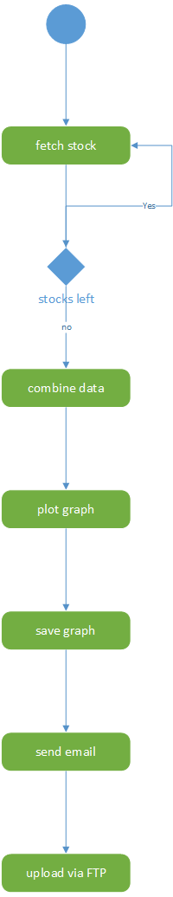

# Sky-Bollin_m122

# Programmablauf visualisieren

# Reflexion
In diesem Projekt konnte ich lernen in Python zu schreiben. Bisher hatte ich nur wenig Erfahrungen mit Skriptsprachen und dem speziellen Syntax. Doch mithilfe von vielen Google-Suchen konnte ich schnell ein gutes Gerüst in diesem Projekt herstellen und später auch benutzen. Dabei hatte ich auch keine Probleme. Erst später als ich mit grossen Datenmengen umgehen musste, kamen Probleme auf. Das Modul pandas half mir dabei extrem. Die gewählte API gab mir z.B. nicht einmal ein Array.
Diese Daten erforderten viele Überarbeitungen und mit der Erweiterung von mehreren Aktien zur gleichen Zeit wurde es noch schwieriger. Ich konnte zu mehreren Linien nicht viel online finden und Daten wollten sich oft nicht verbinden. Von der API bekam ich 100 Einträge, wobei ein Eintrag ein Tag repräsentiert. Dabei kann es aber sein, dass Einträge fehlen. Dies bedeutete dass die Daten von 2 Aktien sich nicht überschneiden konnten und sodurch mir Probleme bereiteten. Doch nach 3-4 Stunden Stunden von Google-Suchen, gelang es mir, mehrere Einträge zu überschneiden.
Dies war in diesem Projekt mein grösstes Problem. Andere Probleme waren eher klein und einfach zu reparieren. Doch zurzeit habe ich auch ein Problem mit dem Senden des PDF's, welches beim Empfangen an Daten verlieren und nicht mehr von PDF-Leser gelesen werden können.

Beim nächsten Mal würde ich gerne eine API nehmen, welche einfach zu verwenden ist, aber erweitert werden kann und sodurch die Komplexität erhöht.
